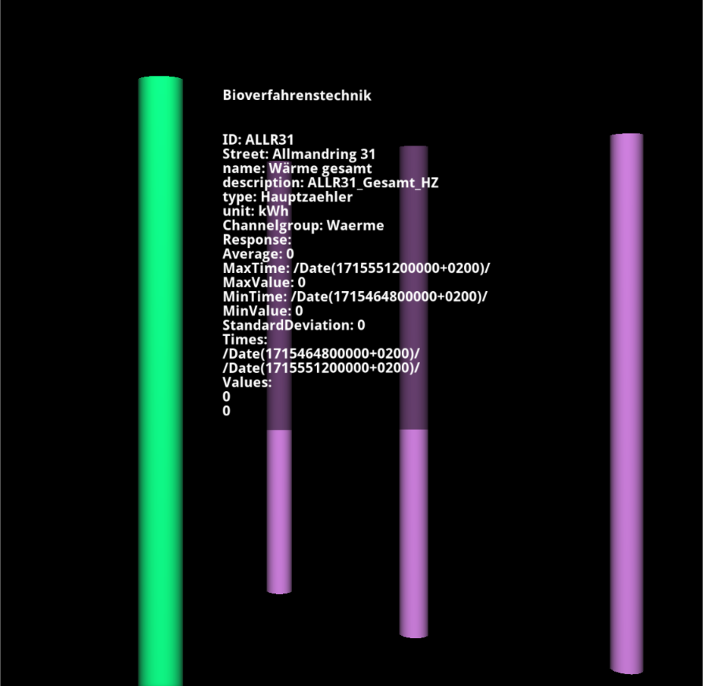

# EnergyCampus

This plugin is for prototyping VR tools for the ongoing project [SRI-DiTEnS](https://www.ditens.de/) using the example of the campus of the [University of Stuttgart](https://www.uni-stuttgart.de/). It will be later on updated to a plugin for a general use.

The main purpose of this plugin is to visualize geo data in VR from different sources (state offices (e.g. [LGL](https://www.lgl-bw.de/)), tileservers (e.g [GoogleMaps](https://www.google.de/maps), [OpenStreetmap](https://www.openstreetmap.de/))) and embedding it into a digital twin. Alongside the process to simplify the building of an urban twin, energy simulation and realtime data of the energy systems of the campus can be visualized in a variety of forms. Additionally different concepts for supporting stakeholder in the decisionmaking process for the discursive transformation process of energy systems are implemented as well. The project is funded by [Carl-Zeis-Stiftung](https://www.carl-zeiss-stiftung.de/).

## Requirements

- [nlohman::json](https://github.com/nlohmann/json)
- [arrow](https://github.com/apache/arrow)
- [PROJ](https://github.com/OSGeo/PROJ) 
- CURL standard shipped in unix systems are enough
- Compiler supporting std c++17

Since its a plugin for OpenCOVER you will need to compile COVER first. Please follow the instructions in the README.md in the root folder of this github repository to compile and install OpenCOVER on your system.

The plugin will be automatically compiled and installed if all requirements are found by CMake and if the CMakeOption **BUILD_ENERGY** is **ON**.

## Software Design

The main plugin is a singleton instance of the class `EnergyPlugin` in `Energy.cpp/.h`. It contains the business logic to access databases and to initialize all different objects of the scene by fetching general information from the config file `<root-repo>/config/plugin/EnergyCampus.toml`.

### System Architecture

The plugin uses a **modular system management approach**. All major subsystems (such as CityGML, Ennovatis, and Simulation) are implemented as classes inheriting from a common interface `ISystem`. These systems are managed in a map:

```c++
std::map<System, std::unique_ptr<ISystem>> m_systems;
```

This allows flexible, type-safe access to each system:

```c++
template <typename T>
T *getSystem(System system) {
    auto it = m_systems.find(system);
    if (it != m_systems.end())
        return dynamic_cast<T *>(it->second.get());
    return nullptr;
}
```

For example:
```c++
CityGMLSystem *cityGML = getSystem<CityGMLSystem>(System::CityGML);
EnnovatisSystem *ennovatis = getSystem<EnnovatisSystem>(System::Ennovatis);
SimulationSystem *simulation = getSystem<SimulationSystem>(System::Simulation);
```

All systems are **non-copyable and non-movable** to ensure unique ownership and prevent accidental duplication. Each system encapsulates its own UI, device sensors, and update logic.

### Interface Pattern

The core of the plugin uses the interface pattern to simplify the process of exchanging different visualization objects without needing to adjust client code. This also allows for easy filtering and interaction with objects in the VR scene based on their capabilities (e.g., moveable, clickable, etc.).

Example usage for interfaces can be seen in `core/PrototypeBuilding.cpp` and `core/TxtInfoboard.cpp`, representing buildings and billboards.

### Ennovatis

The Ennovatis subsystem is managed by the `EnnovatisSystem` class, which handles REST API access, device management, and UI integration. Device sensors are managed as `std::vector<std::unique_ptr<EnnovatisDeviceSensor>>` for safe ownership and automatic cleanup.

### CityGML

The CityGML subsystem is managed by the `CityGMLSystem` class, which handles loading and visualization of CityGML data, PV data, and influx data. Device sensors and color maps are managed internally, and the system provides time-based updates for visualization.

### Simulation

The Simulation subsystem is managed by the `SimulationSystem` class, which handles energy grid simulations and their visualization.

### UI and Scene Management

Each system manages its own UI components and scene graph nodes. The main plugin coordinates system initialization, switching, and updates.

---

**Summary**
- Systems are managed via a map of unique pointers for flexibility and type safety.
- Each system is encapsulated, non-copyable, and non-movable.
- Device sensors are managed with smart pointers.
- The plugin is modular, extensible, and easier to maintain.

---

For more details, see the code in `app/CityGMLSystem.cpp/.h`, `app/EnnovatisSystem.cpp/.h`, and `app/SimulationSystem.cpp/.h`.

## Usage

1. **Setup prerequisites:**
   - Ensure you have a VPN tunnel to the University of Stuttgart network.
   - Set the correct paths to the channel ID JSON and historical data files in `config/plugin/EnergyCampus.toml`.

2. **Build and launch:**
   - Compile OpenCOVER and this plugin as described in the root README.
   - Launch OpenCOVER with the plugin:
     ```bash
     opencover opencover://plugin/EnergyCampus
     ```
   - Alternatively, start OpenCOVER and the TabletUI separately:
     ```bash
     opencover
     tabletUI
     ```
   - In the TabletUI, navigate to the **Plugin** tab and enable **EnergyCampus**. A new tab will appear for plugin controls.

3. **Interact:**
   - Switch to Ennovatis mode by selecting a channel type in the VR menu or TabletUI.
   - Click on buildings in the scene to fetch and display Ennovatis data.
   - Adjust the time period and channels using the input fields and selection lists in the TabletUI tab.
   - Use the **Update** button to fetch new data for the selected period.

## Advanced Usage

### Ennovatis
If you want to switch to the Ennovatis implementation simply click in the VR menu on ***EnergyCampus*** and select a channel type by selecting an ***Ennovatis Channeltype*** like shown in the next picture.


Simlarly you can switch the modes by using the OpenCOVER menu or the before mentioned tabletUI tab. The plugin will switch automatically to ennovatis mode and replace the representation of the historical data with the chosen one for ennovatis. It could look like in the following picture if data has been fetched from the server by clicking on a "building" in the scene.



Further adjustments to the period of time fetched from ennovatis can be made by adjusting the corresponding input boxes ***from*** and ***to*** in the tabletUI tab of the plugin (at the moment only possible through this tab). Afterwards you need to click the button ***Update*** to fetch new data for the given period of time. Other than that the plugin allows the user to switch between different channels of the ennovatis building for the fetched channeltype by selecting another one in the ***Channels*** section of the plugin menu. Alongside the option to switch between channels another selectionlist called ***Enabled Devices*** can be used to switch between all enabled ***EnnovatisDeviceSensors***. The tabletUI tab should look similar like shown in the next image and can be different depending on your operating system.


#### Notes

- only active ***EnnovatisDevicesSensors*** will be updated, because at the time of implementation it wasn't possible to update all buildings at once (by changing the period of time or channeltype for example)
- all active ***EnnovatisDeviceSensors*** which are showing information will be updated if there are changes to the period of time or the channeltype
- ***EnnovatisDeviceSensors*** will change the color of the drawable for each timestep in the color range specified in the config file

## Source Code Organization

- **app**: presentation and ui logic (what happens when clicking a building for example)
- **lib**: buisness logic
- **test**: some tests 
- **resources**: images

## TODO's

- fetch latitude and longitude data from tile-server like googlemaps or openstreetmap
- add new buildings for CityGML
- add calender widget to tabletUI
- implementing concepts for decisionmaking process
- update plugin to use successor of ennovatis
